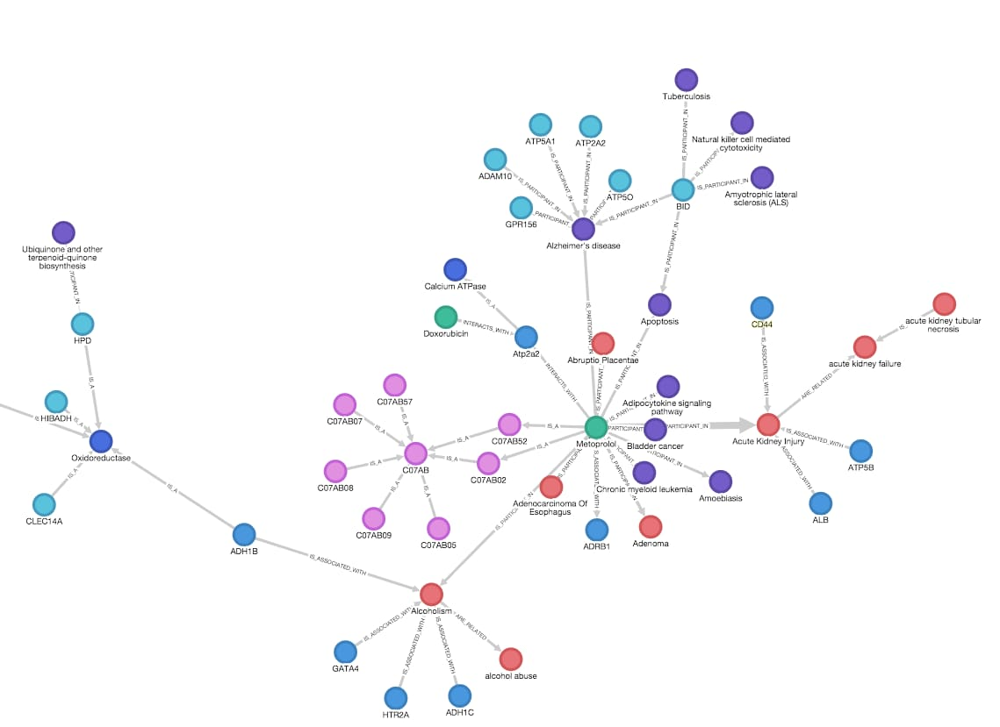

# Введение в GraphRAG

## Что такое GraphRAG?

**GraphRAG** (Graph Retrieval-Augmented Generation) — это продвинутый подход к RAG-системам,
который использует **графы знаний** (Knowledge Graphs) вместо традиционного векторного поиска.

## Основные компоненты

| Компонент | Описание | Преимущество |
|-----------|----------|--------------|
| **Граф знаний** | Структура данных с сущностями (nodes) и связями (edges) | Сохраняет семантические отношения |
| **LLM** | Языковая модель для извлечения и генерации | Понимает контекст |
| **Векторная БД** | Индексация эмбеддингов | Быстрый поиск похожих сущностей |

## Математическое представление

Граф знаний можно представить как тройку:

$$
KG = (E, R, T)
$$

где:
- $E$ — множество сущностей (entities)
- $R$ — множество отношений (relations)
- $T$ — множество триплетов $(h, r, t)$, где $h, t \in E$ и $r \in R$

## Ограничения LLM, которые решает GraphRAG

Книга выделяет 4 ключевые проблемы LLM (Edge et al., 2024 / Bratanič & Hane, 2025):

| Ограничение | Описание |
|-------------|----------|
| **Knowledge cutoff** | Модель не знает событий после даты обучения |
| **Устаревшие данные** | Информация до cutoff тоже может устареть |
| **Галлюцинации** | Модель уверенно выдаёт ложные факты (WikiData ID, URL, цитаты) |
| **Нет приватных данных** | Корпоративная/внутренняя информация не попала в обучение |

Дообучение (fine-tuning) не решает эти проблемы на практике — оно дорогостояще и плохо усваивает новые факты. RAG — более эффективный подход.

## Почему GraphRAG лучше традиционного RAG?

1. **Контекстное понимание** — граф сохраняет связи между данными
2. **Точность ответов** — улучшение на 72–83% по полноте при Query-Focused Summarization
3. **Масштабируемость** — эффективная работа с большими датасетами
4. **Структурированные + неструктурированные данные** — граф объединяет оба типа в одной БД

## Реализация

Типичный стек реализации GraphRAG:
- **Neo4j** — графовая БД с встроенным векторным индексом
- **OpenAI API** (GPT-4o, text-embedding-3-small)
- **LangChain / LlamaIndex** — оркестрация конвейера
