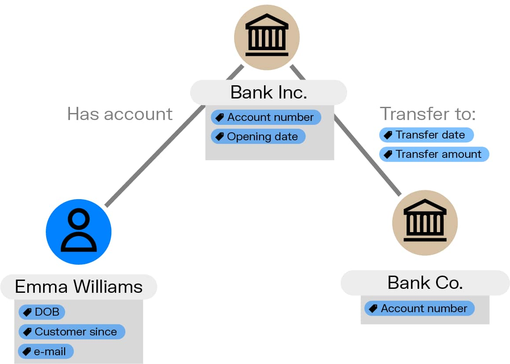

# Архитектура GraphRAG

## Двухэтапный процесс

GraphRAG работает в два основных этапа.

### Этап 1: Индексация (Indexing)

Документы разбиваются на чанки, из которых LLM извлекает сущности и связи.

### Этап 2: Обработка запросов (Query Processing)

Запрос пользователя преобразуется в обход графа, далее происходит обогащение контекста
и генерация ответа языковой моделью.

## Структура индексации (MS GraphRAG, Edge et al. 2024)

| Шаг | Операция | Детали |
|-----|----------|--------|
| 1 | Разбиение текста на чанки | ~1000 слов с перекрытием 40 слов |
| 2 | Извлечение сущностей | PERSON, ORG, LOCATION + доменные типы |
| 3 | Извлечение связей | С силой связи (relationship_strength) |
| 4 | **Обобщение сущностей** | Несколько описаний → единое summary |
| 5 | **Обобщение связей** | Несколько описаний связей → единое summary |
| 6 | Детекция сообществ | Алгоритм Лувена (Louvain) / Leiden |
| 7 | Генерация сводок сообществ | Структурированный отчёт: заголовок, резюме, рейтинг воздействия, ключевые выводы |

> **Важно**: в практических реализациях часто используется алгоритм **Лувена** (Louvain). В оригинальной статье MS GraphRAG (Edge et al., 2024) — Leiden.

## Оптимальный размер чанков

Исследование (Edge et al., 2024) показало: меньший размер чанков = больше извлечённых сущностей.

| Размер чанка | Кол-во ссылок на сущности |
|--------------|--------------------------|
| 600 токенов | максимум (лучший результат) |
| 1200 токенов | меньше |
| 2400 токенов | ещё меньше |

На практике используют **~1000 слов** с перекрытием 40 слов как разумный компромисс.

## Формула качества разбиения

Алгоритм Leiden максимизирует модулярность:

$$
Q = \frac{1}{2m} \sum_{ij} \left[ A_{ij} - \frac{k_i k_j}{2m} \right] \delta(c_i, c_j)
$$

где $m$ — число рёбер, $A_{ij}$ — матрица смежности, $k_i$ — степень узла $i$,
$c_i$ — сообщество узла $i$.
